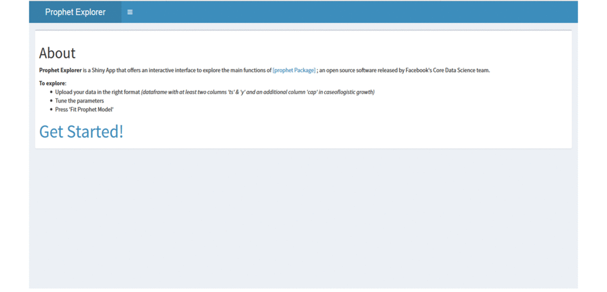

# Prophet Explorer Shiny App

**Prophet Explorer** is a Shiny App that offers an interactive interface to explore the main functions of the [**prophet** Package](https://cran.r-project.org/package=prophet), which is an "[open source software](https://code.facebook.com/projects/) released by Facebook's [Core Data Science team](https://research.fb.com/category/data-science/)".

## Versions

- The first version exists in directory [prophet_explore_0.1.0](https://github.com/OmaymaS/Prophet_Explore/tree/master/prophet_explore_0.1.0)
and deployed [Here](https://omaymas.shinyapps.io/prophet_explore0/).

- The latest version exists in directory [prophet_explore](https://github.com/OmaymaS/Prophet_Explore/tree/master/prophet_explore) and deployed [Here](https://omaymas.shinyapps.io/prophet_explore/)

## prophet Version Used

prophet's version used is the one on Github. 
To install use: *devtools::install_github('facebookincubator/prophet', subdir='R')*
